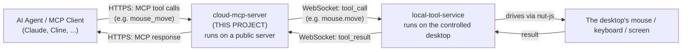
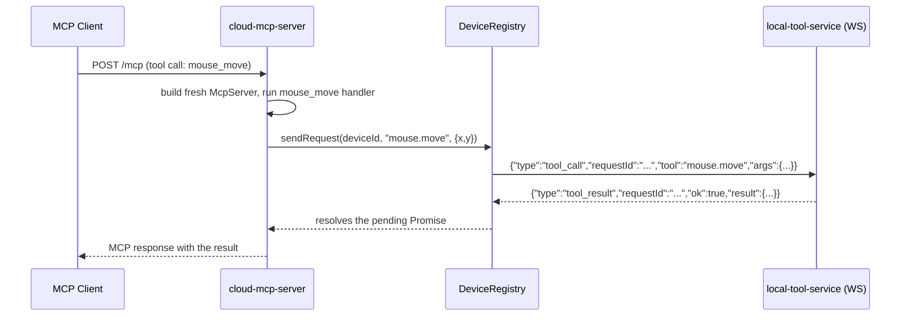
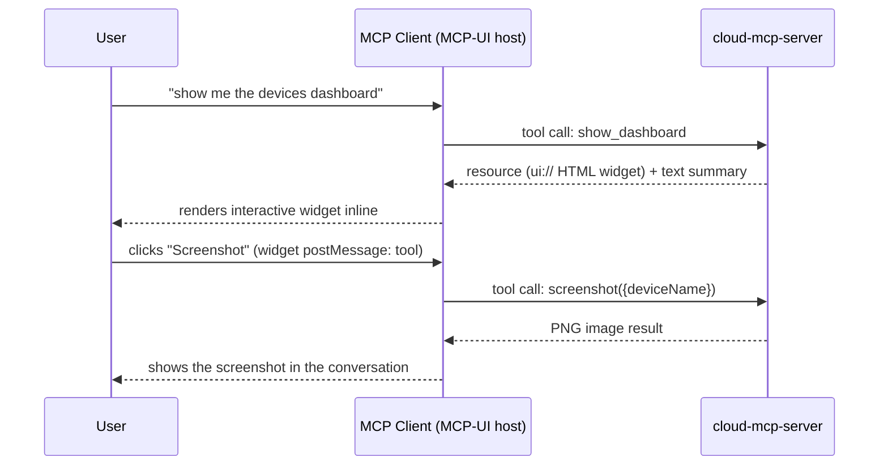

# How Cloud MCP Server Works (Beginner's Guide)

This document explains this project in plain language — no prior MCP or
Node.js server experience assumed. If you only ever read one file to
understand this codebase, read this one.

## 1. What is this project, in one sentence?

`cloud-mcp-server` is a small internet-facing server that lets an AI agent
(the "MCP client", e.g. Claude Desktop or Cline) remotely control a desktop
computer's mouse, keyboard and screen — by forwarding each request over a
WebSocket to a `local-tool-service` running on that desktop.

It never touches the OS itself. It is a **relay / dispatcher**, not a robot.

## 2. Where it fits in the bigger picture

There are 3 projects in this repo. This one is the middle piece:

`local-mcp-server` (the third project) is a completely separate, standalone
alternative that skips the network hop entirely by running directly on the
machine it controls. This project exists for the case where the agent and
the controlled machine are *not* the same computer.

## 3. The framework and libraries, explained simply

| Package | What it actually does here |
|---|---|
| **`@modelcontextprotocol/server`** | The official MCP SDK. Gives us `McpServer` (register "tools" an agent can call) and `createMcpHandler` (turns an `McpServer` into something that speaks the MCP wire protocol over HTTP). |
| **`@modelcontextprotocol/node`** | Small adapter package. `toNodeHandler()` converts the web-standard `fetch`-style handler above into the classic `(req, res) => void` shape that Node's built-in HTTP server expects. |
| **`node:http`** (built into Node.js) | The actual HTTP server, created via `createHttpServer(expressApp)`. |
| **`express`** | A thin routing layer mounted as that server's request handler — used for the REST dashboard API (`/api/*`) and static file serving (`/dashboard`). The `/mcp` route and `/` health check are also registered on it, but `express.json()` body parsing is scoped to `/api` only so it never consumes the MCP Streamable HTTP endpoint's own request stream. Routing lives in [src/app.ts](src/app.ts). |
| **`ws`** | A WebSocket library, used here in *server* mode to accept the persistent connection from each `local-tool-service` device at `/device-link`. |
| **`zod`** | Validates and describes each tool's input arguments (e.g. "`x` must be an integer"). The MCP SDK uses this schema both to validate incoming calls and to tell the agent what arguments a tool needs. |

**What is "MCP"?** The Model Context Protocol is a standard way for an AI
agent to discover a list of named "tools" (each with a description and a
typed argument schema) and call them, getting structured content back. Think
of it like a very small, purpose-built REST API whose shape is
self-describing so any compliant AI client can use it without custom code.

## 4. Step-by-step: what happens when the server starts

Traced through [src/index.ts](src/index.ts) → [src/app.ts](src/app.ts):

1. `createApp()` builds, but does not yet start listening on, three things:
   - a `DeviceRegistry` — an in-memory map of `deviceId → WebSocket`, plus
     bookkeeping for in-flight requests (see [src/relay/device-registry.ts](src/relay/device-registry.ts)).
   - a WebSocket server for the `/device-link` upgrade path (see
     [src/relay/device-link-server.ts](src/relay/device-link-server.ts)).
   - an MCP HTTP handler, built from `createMcpHandler(() => createServer(deviceRegistry))`.
     **Important:** that factory function runs **once per incoming HTTP
     request** — a brand-new `McpServer` with its tools re-registered is
     created for every call. This is how the MCP SDK keeps requests isolated.
2. `index.ts` calls `app.httpServer.listen(port, host)`. By default this is
   `0.0.0.0:4000`.
3. One Express app, passed to `createHttpServer`, now handles every incoming
   HTTP connection:
   - `GET /` → a JSON health check (`{"status":"ok", ...}`).
   - `GET/POST /api/*` → the REST dashboard API ([src/api/dashboard-router.ts](src/api/dashboard-router.ts)).
   - `GET /dashboard/*` → static files from [dashboard/](dashboard/) (the web dashboard UI).
   - anything matching `/mcp` → handed off to the MCP handler.
   - a WebSocket upgrade request for `/device-link` → handed off to the
     device-link WebSocket server (this is attached directly to the
     underlying `http.Server`, not through Express).
   - anything else → `404`.

## 5. Step-by-step: a device connects

1. On the controlled desktop, `local-tool-service` opens an outbound
   WebSocket to `ws://<cloud-host>/device-link`.
2. The very first message it sends is `{"type": "register", "deviceId": "..."}`.
3. [device-link-server.ts](src/relay/device-link-server.ts) reads that
   message and calls `deviceRegistry.register(deviceId, socket, { deviceName, platform })`,
   so the socket is reachable by name and the dashboard can show its
   hostname/OS.
4. Every 30 seconds the cloud server sends `{"type": "ping"}` down the
   socket as a heartbeat; the device answers `{"type": "pong"}`, which also
   refreshes that device's `lastActive` timestamp. If the socket ever
   closes, the device is marked `"offline"` in the registry (kept, not
   deleted, so the dashboard/System Monitor can show it).

## 6. Step-by-step: an agent calls a tool (the full round trip)

Say the agent calls `mouse_move` with `{ deviceName: "abc", x: 100, y: 200 }`:

The code path, file by file:

1. **[src/tools/mouse-move.tool.ts](src/tools/mouse-move.tool.ts)** — registers
   the `mouse_move` tool with a `zod` schema (`deviceName`, `x`, `y`) and a
   handler function.
2. The handler calls **[src/services/service-factory.ts](src/services/service-factory.ts)**'s
   `createServices(deviceName, deviceRegistry)`, which builds 4 small
   "relay-backed" service objects (mouse, keyboard, screenshot, window) all
   bound to that one `deviceId`.
3. It then calls `services.mouseService.move({x, y})` —
   **[src/services/implementations/relay/relay-mouse.service.ts](src/services/implementations/relay/relay-mouse.service.ts)**
   translates this into the shared wire format (`RelayToolName = "mouse.move"`)
   and calls `deviceRegistry.sendRequest(...)`.
4. **[src/relay/device-registry.ts](src/relay/device-registry.ts)**`.sendRequest()`
   generates a random `requestId`, stores a `{resolve, reject, timeout}`
   triple keyed by that id in a `pending` map, sends the JSON message down
   the device's live socket, and returns a `Promise` that the tool handler
   `await`s. If nothing comes back within 15 seconds, the promise rejects
   with a timeout error instead of hanging forever.
5. Once `local-tool-service` executes the action for real and sends back a
   `tool_result` with the matching `requestId`,
   [device-link-server.ts](src/relay/device-link-server.ts) calls
   `registry.handleResult(message)`, which looks up the pending entry and
   resolves (or rejects) it — this is what "wakes up" step 4's `await`.
6. Control returns up the call stack to the tool handler, which wraps the
   result as MCP `content` and returns it. The MCP SDK serializes that as
   the HTTP response to the agent's original `/mcp` request.

Every tool call and result is also logged to stderr (see
`withToolCallLogging` in [src/server/create-server.ts](src/server/create-server.ts))
so you can watch this whole flow happen live in the terminal.

## 7. The available tools

Registered in [src/tools/index.ts](src/tools/index.ts):

| Tool | What it does |
|---|---|
| `list_devices` | Lists which `deviceId`s are currently connected (no relay round-trip — reads the registry directly). |
| `screenshot` | Captures the primary display of the target device. |
| `mouse_move` / `mouse_click` | Moves / clicks the mouse on the target device. |
| `type_text` / `key_press` | Types text / presses a key on the target device. |
| `get_window_list` | Lists open windows on the target device. |
| `show_dashboard` | Renders the connected-devices dashboard **inline inside the agent** as an interactive MCP-UI widget (buttons drive the other tools), plus a Markdown table fallback for text-only clients. This is the primary way to "see the dashboard" — no browser required. |

Every one of these (except `list_devices` and `show_dashboard`) takes a
`deviceName` argument and follows the exact round trip described in section
6 — only the `tool` name and `args` shape change.

## 8. The dashboard — two ways to see it

There are two independent front-ends, both reading the **same**
`DeviceRegistry` and driving the **same** relay path to devices:

### 8a. Inline in the agent (primary) — the `show_dashboard` tool + MCP-UI

When the user asks "show me the devices dashboard", the agent calls the
`show_dashboard` tool. The tool returns an **MCP-UI resource** — an HTML
document with a `ui://…` URI and `text/html` mime type — that MCP-UI-capable
hosts render inline as an interactive widget (a sandboxed iframe). No web
browser and no separate server visit is involved.

Flow, file by file:

1. **[src/tools/show-dashboard.tool.ts](src/tools/show-dashboard.tool.ts)** —
   reads a snapshot of every device from `deviceRegistry.listDevices()` and
   asks the widget builder to render it.
2. **[src/api/dashboard-widget.ts](src/api/dashboard-widget.ts)**`.buildDashboardWidget(devices, publicUrl)`
   returns one self-contained HTML string: the device snapshot is baked in
   as JSON (so the widget shows instantly, with **no network call from the
   iframe**), styles are inline, icons are inline SVG (so it renders even
   when the sandbox blocks CDNs).
3. The tool returns two content blocks: the `resource` (the widget) first,
   then a `text` Markdown summary as a fallback for clients that don't
   render HTML.
4. **Interactivity** uses the MCP-UI convention: every button calls
   `window.parent.postMessage({ type: "tool", payload: { toolName, params } }, "*")`.
   The host agent receives that and invokes the corresponding MCP tool on
   this same server — e.g. "Screenshot" → `screenshot({ deviceName })`,
   "Type" → `type_text`, the X/Y + click button → `mouse_click`, "Windows"
   → `get_window_list`, "List Devices" → `list_devices`, and "Reload
   Dashboard" → `show_dashboard` again. The widget never talks to the REST
   API; it drives the agent's own tools, so it works wherever the tools do.
   It also posts `ui-size-change` so the host can size the iframe to fit.

### 8b. Standalone web page (optional) — REST API + static UI

For viewing in a plain browser (outside any agent), the server also exposes
a small REST API and a static dashboard:

- **[src/api/dashboard-router.ts](src/api/dashboard-router.ts)** — `GET /api/devices`,
  `GET /api/device-status/:deviceId`, `POST /api/action`, `POST /api/refresh`.
  `POST /api/action` dispatches through **[src/services/action-dispatcher.ts](src/services/action-dispatcher.ts)**,
  a thin switch that calls the exact same relay services the MCP tools use —
  there's only one code path to the device, not two.
- **[dashboard/](dashboard/)** — plain HTML/CSS/JS (no build step), served as
  static files at `/dashboard`. Polls `GET /api/devices` every 30 seconds
  and calls the REST API on button clicks.

## 9. Key files at a glance

| File | Responsibility |
|---|---|
| [src/index.ts](src/index.ts) | Starts listening; handles `SIGINT` shutdown. |
| [src/app.ts](src/app.ts) | Builds the HTTP server, wires up routing and the WS upgrade. |
| [src/server/create-server.ts](src/server/create-server.ts) | Builds one `McpServer` instance and registers all tools + logging. |
| [src/relay/device-registry.ts](src/relay/device-registry.ts) | Tracks connected devices; correlates requests ↔ responses. |
| [src/relay/device-link-server.ts](src/relay/device-link-server.ts) | The WebSocket server devices connect to. |
| [src/relay/relay-protocol.ts](src/relay/relay-protocol.ts) | The shared message shapes for the cloud ↔ device WebSocket (kept identical in `local-tool-service`). |
| [src/services/service-factory.ts](src/services/service-factory.ts) | Builds the 4 relay-backed services for a given device. |
| [src/services/implementations/relay/](src/services/implementations/relay) | Translates each service method call into a `RelayToolName` + `sendRequest`. |
| [src/services/action-dispatcher.ts](src/services/action-dispatcher.ts) | Same dispatch, keyed by a plain action name, for the REST `/api/action` route. |
| [src/api/dashboard-router.ts](src/api/dashboard-router.ts) | REST API for the standalone web dashboard. |
| [src/api/dashboard-widget.ts](src/api/dashboard-widget.ts) | Builds the interactive inline MCP-UI widget the `show_dashboard` tool returns. |
| [dashboard/](dashboard/) | The standalone web dashboard UI (plain HTML/CSS/JS). |
| [src/tools/](src/tools) | One file per MCP tool: schema + handler. |

## 10. Glossary

- **MCP tool** — a named, self-describing function an AI agent can call
  (name + description + argument schema).
- **Transport** — how MCP messages physically travel. This project uses
  **Streamable HTTP** (plain HTTP POST/GET to `/mcp`).
- **Relay** — this project's own term for the WebSocket bridge to a
  `local-tool-service`; not part of MCP itself.
- **`requestId` correlation** — because many tool calls could be in flight
  to many devices at once, every relayed message carries a random ID so the
  reply can be matched back to the right waiting `Promise`.
