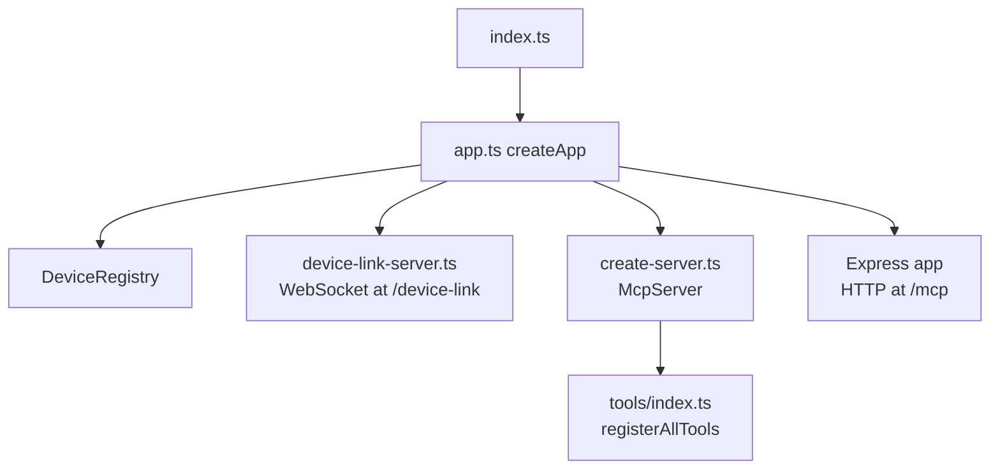
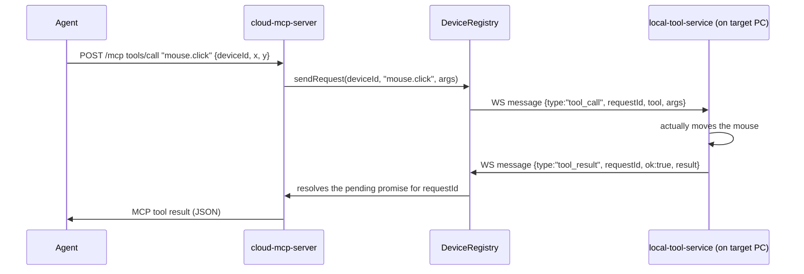

# cloud-mcp-server — Explained

A short, plain-English guide to what this project is and how a tool call flows through it.

---

## 1. What is this project?

This is the **cloud-hosted half** of a two-part system:

```
AI Agent  ──MCP (HTTP)──▶  cloud-mcp-server (this project)  ──WebSocket──▶  local-tool-service (on the target PC)
```

Unlike the sibling [MCP Server](../../) project (which runs directly next to the AI agent and controls the *same* machine), `cloud-mcp-server` is a **relay**: it exposes one internet-facing MCP endpoint, and forwards every tool call over a WebSocket to whichever desktop's `local-tool-service` is currently connected and registered under a given `deviceId`. That local service is the one that actually touches the OS (mouse, keyboard, screen, files, commands).

One cloud server can sit in front of **any number of paired desktops** — the agent just picks which one to control by passing a `deviceId` argument.

⚠️ **No authentication in v1.** Anyone who knows a device's `deviceId` (treat it like a secret, e.g. a random UUID) can send it tool calls. Don't expose this publicly without adding real auth.

---

## 2. Framework / tech stack

| Concern | Choice |
| --- | --- |
| Language | TypeScript, compiled via `tsc` |
| Runtime | Node.js |
| MCP SDK | `@modelcontextprotocol/server` (+ `@modelcontextprotocol/node` for HTTP) |
| HTTP routing | `express` |
| Relay transport | `ws` (raw WebSocket server) |
| Validation | `zod` |
| Testing | `node:test`, against a fake WebSocket "local service" (`tests/relay/relay.test.ts`) |

---

## 3. Entrypoint & startup flow



- **[src/index.ts](../src/index.ts)** — the real entrypoint (`npm start`). Reads `PORT`/`HOST` env vars, calls `createApp()`, and starts listening. That's it — all the wiring lives in `app.ts`.
- **[src/app.ts](../src/app.ts)** — builds everything *without* starting to listen (so tests can bind an ephemeral port instead):
  - one `DeviceRegistry` (tracks which desktops are connected)
  - one `device-link-server` (accepts WebSocket connections from `local-tool-service` instances at `/device-link`)
  - one `McpServer` via `create-server.ts`, mounted on Express at `/mcp` (the single "universal" endpoint every agent talks to)
- **[src/server/create-server.ts](../src/server/create-server.ts)** — builds the `McpServer` and calls `registerAllTools(...)`. It also wraps `registerTool` so every call logs `tool_call`/`tool_result` lines to stderr (visible in whatever hosts this process, e.g. cloud logs).

---

## 4. How tools are added to the MCP server

Same pattern as the local project: one file per tool, all wired up in one place.

- **[src/tools/index.ts](../src/tools/index.ts)** — `registerAllTools()` just calls one `register*Tool(server, deviceRegistry)` function per tool: `list_devices`, `screenshot`, `mouse`, `keyboard`, `get_window_list`, `cmd`, `get_file`.
- **Each `*.tool.ts` file**:
  1. Declares a `zod` `inputSchema` — every device-targeted tool's schema starts with `deviceId: z.string()`.
  2. Registers itself with `server.registerTool(name, config, handler)`.
  3. Inside the handler, it either:
     - calls `deviceRegistry.sendRequest(deviceId, relayToolName, args)` directly (e.g. `cmd.tool.ts`), or
     - goes through a small service abstraction (`createServices(deviceId, deviceRegistry)` in [service-factory.ts](../src/services/service-factory.ts)) for `screenshot`/`get_window_list`, mirroring the local project's `I*Service` pattern — those services just call `registry.sendRequest(...)` internally too (see [relay-screenshot.service.ts](../src/services/implementations/relay/relay-screenshot.service.ts)).
  4. Returns a normal MCP tool result (`{ content: [...] }`).

`list_devices` is special — it doesn't relay anything; it just reads `deviceRegistry.listDevices()` directly, so an agent can discover valid `deviceId`s before calling anything else.

---

## 5. The "universal format"

Two things are "universal" here:

1. **One universal MCP endpoint** (`/mcp`). There's no per-device URL or per-device server instance — every agent connects to the exact same endpoint, and every tool call names its target device via a `deviceId` argument (discovered via `list_devices`). This is what lets one cloud server front unlimited desktops.

2. **One universal WebSocket wire format** between this server and every `local-tool-service`, defined in [src/relay/relay-protocol.ts](../src/relay/relay-protocol.ts) (kept byte-for-byte identical in both projects). Every message is a JSON object with a `type` field:

   | `type` | Direction | Purpose |
   | --- | --- | --- |
   | `register` | device → cloud | "I'm online, here's my `deviceId`/name/platform" |
   | `ping` / `pong` | cloud ↔ device | Heartbeat, keeps the connection alive & marks `lastActive` |
   | `tool_call` | cloud → device | `{ requestId, tool: RelayToolName, args }` — one specific action to perform |
   | `tool_result` | device → cloud | `{ requestId, ok, result }` or `{ requestId, ok: false, error }` |

   `RelayToolName` (e.g. `"mouse.click"`, `"screenshot.capturePrimaryDisplay"`, `"cmd.execute"`) mirrors the local service's method names 1:1, so both ends can dispatch with a plain `switch`. The `requestId` (a UUID) is how `DeviceRegistry.sendRequest()` matches an outgoing `tool_call` to its eventual `tool_result`, including timing out if no response arrives.

---

## 6. Code flow for one tool call (simple version)



Step by step:
1. An agent calls a tool over `/mcp` with a `deviceId` plus that tool's own arguments.
2. The tool handler resolves the target device (directly or via a small `I*Service`) and calls `deviceRegistry.sendRequest(deviceId, relayToolName, args)`.
3. `sendRequest` generates a `requestId`, stores a pending Promise, and sends a `tool_call` WebSocket frame to that device's socket.
4. The `local-tool-service` on the actual target PC executes the real action and sends back a `tool_result` frame with the same `requestId`.
5. `device-link-server.ts` receives it, calls `registry.handleResult(message)`, which resolves (or rejects, on error/timeout) the matching pending Promise.
6. The tool handler's `await` returns, and the MCP server sends the result back to the agent — same shape whichever device it came from.

---

## 7. Quick mental model if you're new to this codebase

- This server never touches the OS itself — it's a **switchboard**. All real work happens in `local-tool-service` (a separate project) running on the controlled PC.
- Adding a new tool = one new `*.tool.ts` file (with a `deviceId` field) + one new `RelayToolName` entry in `relay-protocol.ts` + a matching handler in `local-tool-service`.
- `DeviceRegistry` is the only stateful piece here: it tracks *who's connected* (WebSocket sockets keyed by `deviceId`) and *what's in flight* (pending `requestId` → Promise pairs).
- If a `tool_call` never gets a `tool_result` within the timeout (15s default, longer for `cmd`), the agent gets a timeout error — usually meaning that device is offline or its `local-tool-service` crashed.
