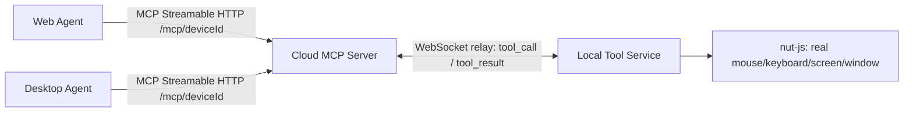

# Plan: Cloud MCP Server + Local Tool Service (relay architecture) — ✅ Implemented

> **Superseded detail:** this plan originally routed by URL, one MCP endpoint per device
> (`/mcp/<deviceId>`). That was replaced by a single universal `/mcp` endpoint where every
> tool takes a `deviceName` argument instead — see
> [MULTI_DEVICE_FLOW.md](MULTI_DEVICE_FLOW.md) for the current design. Everything else below
> (relay protocol, device registry, WebSocket transport) is unchanged.

## TL;DR
Split into 2 new, fully separate standalone projects (sibling folders in this workspace,
duplicated code, no shared npm workspace per user's choice):

- **cloud-mcp-server/** — internet-facing. Speaks real MCP (Streamable HTTP, reusing
  `@modelcontextprotocol/server`/`node`) to web/desktop agents over one universal `/mcp`
  endpoint (see the superseded-detail note above). Never touches the OS directly — its 4
  `I*Service` implementations are "Relay*Service" classes that forward each call over a
  WebSocket to the matching connected Local Tool Service and await the JSON result.
- **local-tool-service/** — runs on the controlled desktop. Reuses (copies) the existing
  `Nutjs*Service` implementations verbatim. Opens an **outbound** WebSocket connection to
  the cloud server (NAT/firewall-friendly), registers its `deviceId`, and dispatches
  incoming tool-call messages to the real nut-js services, sending results back.

Existing repo (`D:\MCP Server`) is untouched — local-server.ts/remote-server.ts keep working
as direct single-machine MCP servers. This is purely additive.

**Architecture**

## Decisions (confirmed with user)
- **Multi-device**: v1 supports multiple local desktops registering; each agent MCP
  connection targets one device via `deviceId` in the URL path.
- **Auth**: none in v1 (explicit user choice, matches original repo's "no auth" scope).
  ⚠️ Flagged risk: with zero auth, whoever knows/guesses a `deviceId` can send tool calls to
  that desktop (full mouse/keyboard/screen control) through the cloud server. Mitigate in
  v1 by treating `deviceId` as an unguessable secret (random UUID v4, not sequential/short),
  generated by the local service and out-of-band shared with its intended agent(s)/user.
  Real auth (bearer tokens for both the device link and the agent MCP connection) should be
  added before any real/production exposure — call this out again before deploying publicly.
- **Repo structure**: fully separate projects, each with own package.json/tsconfig, code
  duplicated (not an npm-workspaces monorepo). Keep the duplicated files structurally
  identical (same names/shapes) to ease manual sync later.
- **Relay transport**: WebSocket (`ws` package) between cloud server and local service.
  JSON text frames; screenshots carried as base64 PNG inside the JSON `result` (reuses
  `ScreenshotResult` shape unchanged). Raise `ws`'s `maxPayload` so multi-MB screenshots
  aren't rejected. Optional future optimization: binary WS frames for the image bytes to
  avoid ~33% base64 overhead — not needed for v1.
- **Existing single-machine servers**: kept as-is, untouched.

## Relay protocol (duplicated identically in both new projects)
Message envelope over one WebSocket connection per device:
- `{ type: "register", deviceId: string }` — sent once by local service on connect.
- `{ type: "ping" }` / `{ type: "pong" }` — heartbeat, local service or cloud can initiate.
- `{ type: "tool_call", requestId: string, tool: RelayToolName, args: unknown }` — cloud → local.
- `{ type: "tool_result", requestId: string, ok: true, result: unknown }` — local → cloud.
- `{ type: "tool_result", requestId: string, ok: false, error: string }` — local → cloud.

`RelayToolName` mirrors the 4 `I*Service` method names 1:1 so dispatch is a plain switch on
both ends: `"mouse.move" | "mouse.click" | "keyboard.typeText" | "keyboard.keyPress" |
"screenshot.capturePrimaryDisplay" | "window.listWindows"`.

Cloud server keeps, per process (in-memory, v1 = single instance, no horizontal scaling):
- `Map<deviceId, WebSocket>` — connected local services.
- `Map<requestId, { resolve, reject, timeoutHandle }>` — in-flight relay requests, per device
  connection (or global, keyed by requestId since requestId is already unique).
A new local-service connection claiming an already-registered `deviceId` replaces the old
one (last-writer-wins, v1). If a tool_call targets a `deviceId` with no live connection, the
Relay*Service rejects immediately with a clear "device offline" error → surfaces as an MCP
tool error to the agent.

## Steps

### Phase 1 — Scaffold & shared protocol types (no dependencies)
1. Create `local-tool-service/` project (package.json, tsconfig.json, `type: module`).
   Copy from current repo, adjusting relative import paths:
   - `src/models/*.models.ts`
   - `src/services/interfaces/*.service.ts`
   - `src/services/implementations/nutjs/*.ts` (the 4 real service classes)
   Add dependency: `ws` (+ `@types/ws` dev), plus `@nut-tree-fork/nut-js` (same as today).
2. Create `cloud-mcp-server/` project (package.json, tsconfig.json, `type: module`). Copy:
   - `src/models/*.models.ts`
   - `src/services/interfaces/*.service.ts`
   - `src/tools/*.tool.ts` and `src/tools/index.ts` (unchanged — they only depend on
     `ServiceRegistry`/interfaces)
   - `src/server/create-server.ts`, modified to accept an injected `ServiceRegistry` param
     (default falls back to constructing one, so the signature stays compatible in spirit
     with the original repo's factory)
   Add dependencies: `ws` (+ `@types/ws`), `@modelcontextprotocol/server`,
   `@modelcontextprotocol/node`, `zod`.
3. Write `relay-protocol.ts` (the message types above) identically into both new projects.

### Phase 2 — Cloud MCP Server (depends on Phase 1, can run parallel with Phase 3)
4. `device-registry.ts` — `Map<deviceId, WebSocket>` plus register/unregister/lookup and a
   `sendRequest(deviceId, tool, args, timeoutMs)` helper that creates a `requestId` (uuid),
   tracks it in the pending-requests map, writes the `tool_call` frame, and returns a Promise
   resolved/rejected when the matching `tool_result` arrives or the timeout fires.
5. Four `Relay*Service` classes (`RelayMouseService`, `RelayKeyboardService`,
   `RelayScreenshotService`, `RelayWindowService`) implementing the copied `I*Service`
   interfaces; each method just calls `deviceRegistry.sendRequest(deviceId, "<tool name>", args)`
   and returns the result as-is (same result shape as `NutjsMouseService` etc., so tool files
   need zero changes).
6. WebSocket server endpoint (e.g. path `/device-link`) accepting local-service connections;
   on first message expects `{type:"register", deviceId}}`, registers it in the device
   registry; handles `tool_result` and `pong` messages; on socket close, unregisters the
   device (only if it's still the current connection for that id).
7. Per-device MCP HTTP routing: **resolved during implementation** —
   `createMcpHandler`'s factory is actually called once per HTTP request with
   an `McpRequestContext` that includes `requestInfo` (the original web-standard
   `Request`), so the deviceId is parsed straight from `ctx.requestInfo.url`
   inside a single shared `createMcpHandler(...)` — no manual per-device
   handler caching needed. See `cloud-mcp-server/src/app.ts`.
8. Entrypoint `index.ts`: starts the shared HTTP server (MCP routes + WS upgrade for
   `/device-link`) on `PORT`/`HOST` env vars; logs listening address.

### Phase 3 — Local Tool Service (depends on Phase 1, parallel with Phase 2)

**Process model decision:** NOT a classic Session-0 Windows Service / system launchd
daemon / system systemd service — those run outside the interactive desktop session and
cannot see/control the logged-in user's mouse, keyboard, or screen (Windows Session 0
isolation; macOS Accessibility/Screen Recording grants are per-user-session; Linux has no
`DISPLAY` in a system service). Instead, this is a **per-user, autostart-at-login background
process** running inside the user's own session:

| OS | Autostart mechanism | Notes |
| --- | --- | --- |
| Windows | Scheduled Task, trigger "at log on" (current user), run **not elevated** (`/rl limited`) so it stays in the interactive session; launched hidden (small VBS/launcher wrapper to suppress the console window) | Shows under Task Scheduler Library, not the Services tab — that's specifically Session-0 only |
| macOS | LaunchAgent plist in `~/Library/LaunchAgents/`, `RunAtLoad` + `KeepAlive`, loaded via `launchctl bootstrap gui/$(id -u)` | Runs inside the user's GUI session, so Accessibility/Screen Recording prompts work normally |
| Linux | systemd **user** service in `~/.config/systemd/user/`, `systemctl --user enable --now` | Inherits the session's `DISPLAY`/X11 access (still X11-only per nut-js) |

9. WebSocket client: connect to `CLOUD_URL` (env/config), send `register` with `DEVICE_ID`
   (a random UUID v4, generated once on first run and persisted to a local config file if
   not supplied — doubles as the only access-control mitigation given "no auth" in v1).
10. Reconnect-with-backoff (e.g. capped exponential) on close/error; periodic ping to detect
    dead connections.
11. Dispatcher: on `tool_call`, switch on `tool` name → call the matching copied
    `Nutjs*Service` method with `args`, wrap the resolved value as
    `{type:"tool_result", requestId, ok:true, result}}`, or catch and send
    `{ok:false, error: String(err)}`.
12. Entrypoint `index.ts` wiring env config → WS client → dispatcher → (optional) tray icon.
13. **Install/uninstall CLI** (`local-tool-service install` / `uninstall` / `start`
    subcommands, dispatched by `process.platform`):
    - `install-windows.ts` — shells out to `schtasks /create /sc onlogon /rl limited ...`.
    - `install-macos.ts` — writes the LaunchAgent plist, runs `launchctl bootstrap`.
    - `install-linux.ts` — writes the systemd user unit, runs
      `systemctl --user enable --now`.
    - `uninstall` reverses each (remove task/unload agent/disable unit) and deletes the
      written config file.
14. **System tray icon** (per user decision) using `systray2` (MIT, cross-platform, wraps a
    small prebuilt per-OS Go binary — verify the bundled binary installs cleanly on the
    target OS/arch during implementation, same caveat class as nut-js's native binaries).
    Menu: connection status (enabled/disabled label), Device ID (click to copy), Open Logs,
    Quit. Only initialized after the WS client starts; tray process lives in the same
    long-running background process, not a separate one.

### Phase 4 — Integration & verification (depends on Phase 2 & 3)
15. Manual E2E: run local-tool-service pointed at a locally-run cloud-mcp-server (same
    machine, two terminals/processes); connect an MCP test client (same pattern as the
    existing repo's `tests/tools/tools.test.ts`) to `http://localhost:<port>/mcp` (universal
    endpoint, `deviceName` passed per tool call — see the superseded-detail note above);
    call all 6 tools; confirm round-trip results, including a real screenshot's base64 PNG
    surviving the relay hop intact (compare decoded width/height).
16. Add automated relay-level tests to `cloud-mcp-server`: an in-process fake WebSocket
    "local service" that responds to `tool_call` deterministically (placeholder-style
    values), verifying `Relay*Service` + tool layer + device routing without needing real
    nut-js/OS access — mirrors today's placeholder testing approach.
17. Add a small "device offline" test: call a tool for an unregistered `deviceId`, assert a
    clear MCP tool error surfaces (not a hang/timeout in the test itself — use a short
    timeout for this case).

### Phase 5 — Docs (light, per new project)
18. Minimal README in each new project: how to configure (`PORT`/`HOST` for cloud,
    `CLOUD_URL`/`DEVICE_ID` for local), how to run both together, and a clearly visible
    "no auth yet — do not expose publicly without adding tokens" warning.

## Relevant files (new projects; current repo untouched)
- `cloud-mcp-server/src/relay-protocol.ts`, `device-registry.ts`,
  `services/implementations/relay/relay-*.service.ts`, `server/create-server.ts`,
  `server/http-server.ts` (or similar), `index.ts`.
- `local-tool-service/src/relay-protocol.ts`, `relay-client.ts`, `dispatcher.ts`, `index.ts`,
  plus copied `models/`, `services/interfaces/`, `services/implementations/nutjs/`.
- Reference/reuse source (read-only) from current repo: `src/tools/*.tool.ts`,
  `src/server/create-server.ts`, `src/models/*.ts`, `src/services/interfaces/*.ts`,
  `src/services/implementations/nutjs/*.ts`.

## Verification
1. `npm install` + `npm run build` succeed in both new projects independently.
2. Automated relay-level tests (step 16/17) pass in `cloud-mcp-server`.
3. Manual E2E (step 15) round-trips all 6 tools through the relay on one machine.
4. Confirm reconnect logic: kill/restart the local-tool-service process, confirm the cloud
   server's device registry drops then re-registers it, and a new tool call after
   reconnect succeeds.

## Further considerations
1. **No-auth risk** is the biggest open item — revisit before any real deployment; v1's only
   mitigation is treating `deviceId` as an unguessable secret.
2. Cloud server is single-instance/in-memory for v1 — horizontal scaling (multiple cloud
   server instances) would need a shared broker (e.g. Redis pub/sub) to route requests to
   whichever instance holds the target device's WebSocket; out of scope for v1.
3. `createMcpHandler` per-device factory wiring (step 7) — **resolved**: the factory
   receives an `McpRequestContext` with `requestInfo` per HTTP request, so device
   resolution is a plain per-request URL parse, no caching layer required.
4. Deployment: needs a regular long-running Node host with WebSocket support (VPS,
   Fly.io/Railway/EC2, etc.) — not a serverless/functions platform.
5. Windows hidden-launch of the Scheduled Task (no visible console window) needs a small
   launcher wrapper (e.g. a `.vbs`/`wscript` shim, or packaging via `pkg`) — implementation
   detail to finalize during Phase 3.
6. `systray2`'s bundled per-OS Go tray binary should be smoke-tested on each target
   OS/arch early, same class of risk as nut-js's native binaries.
