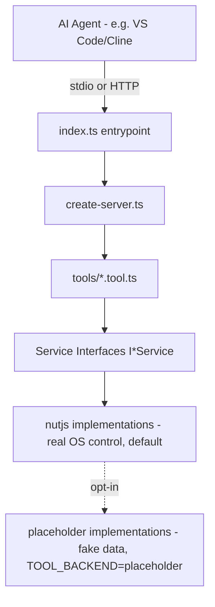

# Project Explained (Beginner Guide)

A short, plain-English guide to what this project is, how it's built, and how to run/test/connect to it.

---

## 1. What is this project?

This is an **MCP (Model Context Protocol) server**. MCP is a standard that lets AI agents (like Cline, Claude Desktop, or any MCP-compatible agent) call "tools" to control a computer — take screenshots, move the mouse, click, type text, press keys, and list open windows.

Think of it like a small API server, but instead of HTTP REST endpoints for a web app, it exposes **tools** that an AI agent can discover and call automatically.

It currently exposes **6 tools**:

| Tool | What it does |
| --- | --- |
| `screenshot` | Captures the primary display as a PNG image |
| `mouse_click` | Moves the mouse to `x,y` and clicks (left/right, single/double) |
| `mouse_move` | Moves the mouse to `x,y` without clicking |
| `type_text` | Types a string of text via the keyboard |
| `key_press` | Presses key combos, e.g. `Ctrl+S`, `Alt+Tab` |
| `get_window_list` | Lists visible windows with titles/positions |

✅ **Real OS control:** these tools drive the real mouse, keyboard, screen, and window list via [`@nut-tree-fork/nut-js`](https://www.npmjs.com/package/@nut-tree-fork/nut-js), a single cross-platform (Windows/macOS/Linux X11) native automation package. A deterministic `placeholder` backend (fake data, no OS access) remains available via `TOOL_BACKEND=placeholder` for offline/no-display environments (see [Section 4](#4-what-is-actually-implemented-today)).

---

## 2. Framework / tech stack

| Concern | Choice |
| --- | --- |
| Language | TypeScript (compiled to JS via `tsc`) |
| Runtime | Node.js |
| MCP SDK | `@modelcontextprotocol/server` (+ `@modelcontextprotocol/node` for HTTP, `@modelcontextprotocol/client` for tests) — the official MCP v2 SDK |
| Validation | `zod` — validates each tool's input arguments |
| Testing | Node's built-in `node:test` runner (no extra test framework) |
| Build | `tsc` (TypeScript compiler), output goes to `build/` |

There is no database, no web frontend, and no authentication — this is a small, focused backend service.

---

## 3. How the code is structured (the "shape" of the server)



- **[src/index.ts](../src/index.ts)** — the entrypoint. Reads the `MCP_TRANSPORT` env var to decide: run over `stdio` (local) or `http` (remote).
- **[src/server/create-server.ts](../src/server/create-server.ts)** — builds one shared `McpServer` and registers all 6 tools. Both transports call this same function, so local and remote behave identically.
- **[src/server/local-server.ts](../src/server/local-server.ts)** — starts the server over **stdio** (standard input/output). This is how a local AI agent process (like VS Code's Copilot/Cline) talks to it — it just launches this file as a child process.
- **[src/server/remote-server.ts](../src/server/remote-server.ts)** — starts the server over **Streamable HTTP** on `http://127.0.0.1:3000/mcp`, for agents connecting over a network.
- **[src/tools/*.tool.ts](../src/tools/)** — one file per tool. Each just validates input (via `zod`) and calls a service — it never talks to the OS directly.
- **[src/services/interfaces/*.ts](../src/services/interfaces/)** — TypeScript interfaces (contracts), e.g. `IMouseService`, `IKeyboardService`. These define *what* a service must do, not *how*.
- **[src/services/implementations/nutjs/*.ts](../src/services/implementations/nutjs/)** — the default implementations. They call `@nut-tree-fork/nut-js` to really move the mouse, send keystrokes, capture the screen, and list windows.
- **[src/services/implementations/placeholder/*.ts](../src/services/implementations/placeholder/)** — fabricate deterministic fake responses (no real mouse/keyboard/screen access); opt in via `TOOL_BACKEND=placeholder`.
- **[src/services/service-factory.ts](../src/services/service-factory.ts)** — picks which implementation to use based on the `TOOL_BACKEND` env var (`"nutjs"` default, or `"placeholder"`).
- **[src/models/*.ts](../src/models/)** — shared TypeScript types for requests/results.

**Why the layers?** So that later, someone can write a real `WindowsMouseService` (that actually moves the mouse), register it in `service-factory.ts`, and nothing in `tools/` or `server/` needs to change.

---

## 4. What is actually implemented today?

✅ Done (Phase 1 + Phase 2 + Phase 3 of the [implementation plan](IMPLEMENTATION_PLAN.md)):
- All 6 MCP tools, registered on a shared server
- Local stdio transport
- Remote Streamable HTTP transport (loopback-only, with Host/Origin header validation)
- Real, cross-platform service implementations for screenshot/mouse/keyboard/window via `@nut-tree-fork/nut-js` (default backend), plus a `placeholder` fallback backend
- Automated tests that exercise every tool through a real in-process MCP client

🔜 Not done (explicitly out of scope for now):
- Authentication (no API keys, no auth of any kind)
- Docker packaging

**Platform prerequisites for the real (`nutjs`) backend:**
- Windows: none extra, prebuilt binaries are installed by `npm install`.
- macOS: grant the terminal/IDE running the process both **Accessibility** and **Screen Recording** permissions.
- Linux: requires `libxtst-dev` and an X11 session — Wayland is not supported.

---

## 5. How to build & start the server

Install dependencies once, then compile TypeScript to `build/`:

```powershell
npm install
npm run build
```

**Run locally (stdio)** — this is what an AI agent launches as a child process:

```powershell
npm start
```

This runs `node build/server/local-server.js` and waits for a client to connect over stdin/stdout. It won't print much — that's expected, stdio mode is meant to be driven by an MCP client, not used interactively in a terminal.

**Run remotely (HTTP)** — for a client connecting over the network:

```powershell
npm run start:remote
```

This starts an HTTP server at `http://127.0.0.1:3000/mcp` (override with `PORT` / `HOST` env vars). You'll see a log line:

```
RemotePC MCP remote server listening on http://127.0.0.1:3000/mcp
```

---

## 6. How to test

Tests use Node's built-in test runner and spin up a real in-process MCP client against the server — no OS access, no real network socket:

```powershell
npm test
```

This runs `pretest` first (compiles `src/` and `tests/` via `tsconfig.test.json` into `build-test/`), then runs every `*.test.js` under `build-test/tests/`. See [tests/tools/tools.test.ts](../tests/tools/tools.test.ts) — it checks that all 6 tools are discoverable and that each one returns the expected mock response.

---

## 7. How to connect a local AI agent (e.g. VS Code / Cline)

The repo already includes [.vscode/mcp.json](../.vscode/mcp.json), so VS Code's MCP-aware agent tooling can auto-discover this server. It looks like:

```json
{
  "servers": {
    "remotepc-mcp": {
      "type": "stdio",
      "command": "node",
      "args": ["${workspaceFolder}/local-mcp-server/build/index.js"]
    }
  }
}
```

To use it:
1. Run `cd local-mcp-server && npm run build` at least once so `local-mcp-server/build/index.js` exists.
2. Open this workspace in VS Code — the MCP server config is picked up automatically from `.vscode/mcp.json`.
3. Start/enable the `remotepc-mcp` server from the MCP UI (or your agent's tool panel) — the agent will launch `node local-mcp-server/build/index.js` for you and talk to it over stdio.

For other MCP hosts (e.g. Cline directly), point them at the same command:

```json
{
  "mcpServers": {
    "remotepc-mcp": {
      "command": "node",
      "args": ["D:\\MCP Server\\local-mcp-server\\build\\index.js"]
    }
  }
}
```

For a **remote** connection instead, run `npm run start:remote` and configure the client with:

```json
{
  "mcpServers": {
    "remotepc-mcp": {
      "type": "http",
      "url": "http://127.0.0.1:3000/mcp"
    }
  }
}
```

---

## 8. How to get logs

- **stdio mode (`npm start`):** the server can't log to stdout (that channel carries the MCP protocol messages). Any diagnostic logging must go to **stderr** (`console.error(...)`) so it doesn't corrupt the protocol stream. If you're launching it from VS Code/Cline, check that agent's own "MCP server output/logs" panel — it captures the child process's stderr.
- **HTTP mode (`npm run start:remote`):** run it directly in a terminal (as shown above) and its `console.error(...)` output (e.g. the "listening on ..." line and any future error logs) prints straight to that terminal.
- There's currently only one log line in the whole codebase ([src/server/remote-server.ts](../src/server/remote-server.ts)). If you need more visibility while debugging, add `console.error(...)` calls inside the relevant `tool.ts` or service file — just avoid `console.log` in stdio mode, since stdout is reserved for MCP protocol traffic.

---

## 9. Quick mental model if you're new to this codebase

1. An AI agent starts `index.ts` as a subprocess (or connects over HTTP).
2. `create-server.ts` builds one `McpServer` and registers 6 tools.
3. The agent calls a tool, e.g. `mouse_click` with `{x: 100, y: 200}`.
4. `mouse-click.tool.ts` validates the input with `zod`, then calls `services.mouseService.click(...)`.
5. Today, `mouseService` is `PlaceholderMouseService` — it just returns a fake "success" response, it doesn't move any real mouse.
6. The response goes back to the agent as a standard MCP tool result.

This is now real: `mouseService` is `NutjsMouseService`, backed by `@nut-tree-fork/nut-js`, and it really moves the OS mouse cursor. Swapping backends (e.g. back to `placeholder`) only ever means changing `TOOL_BACKEND` in [service-factory.ts](../src/services/service-factory.ts) — no other file needs to change.
