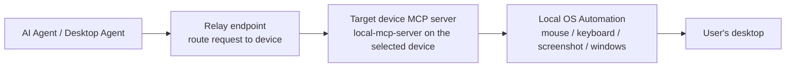
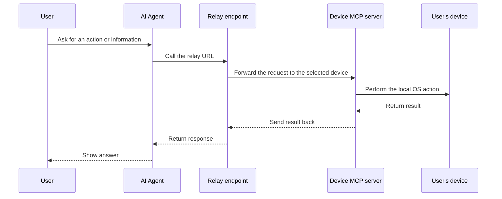
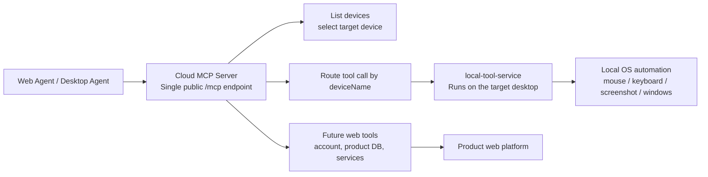
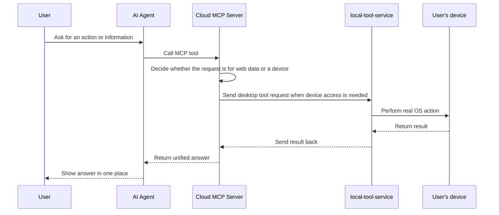

# MCP Flow for Manager Presentation

This document gives a short, presentation-friendly view of the current local MCP setup and the planned cloud MCP setup.

## 1. Current model: local MCP server on each device

This is the same basic pattern used by HopToDesk-style desktop control: the agent connects to a relay endpoint first, and the relay routes the request to the correct device's local MCP server when it wants screen, mouse, keyboard, or window access.

### What this gives us today

- The agent can access the user's local system.
- The relay can direct each request to the correct device MCP server.
- Each device is controlled independently.
- The implementation stays simple because the local server is focused only on desktop automation.

### End-to-end flow in simple terms

## 2. Planned model: cloud MCP server + local tool service

The cloud MCP server becomes the central entry point for agents. It will route device actions to the correct desktop through `local-tool-service`, and later it can also expose web tools and product services.

### Why the cloud model matters

- One agent connection can see all connected devices.
- The cloud server can later include web-based tools, not only desktop control.
- User context can live in one place: account data, product data, device data, and desktop actions.
- This makes the agent experience more complete for both web and desktop usage.

## 3. End-to-end flow in simple terms

## 4. Simple talking points

- Today: we already support local desktop access through a local MCP server.
- Next: the cloud MCP server will become the central control plane for many devices.
- Later: the same cloud server can also expose product web tools, account data, and internal services, so the user gets a single place to ask questions and act on both web and desktop resources.
