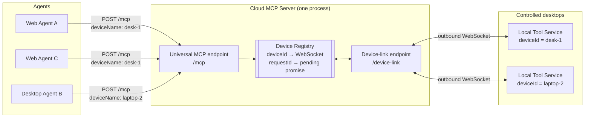
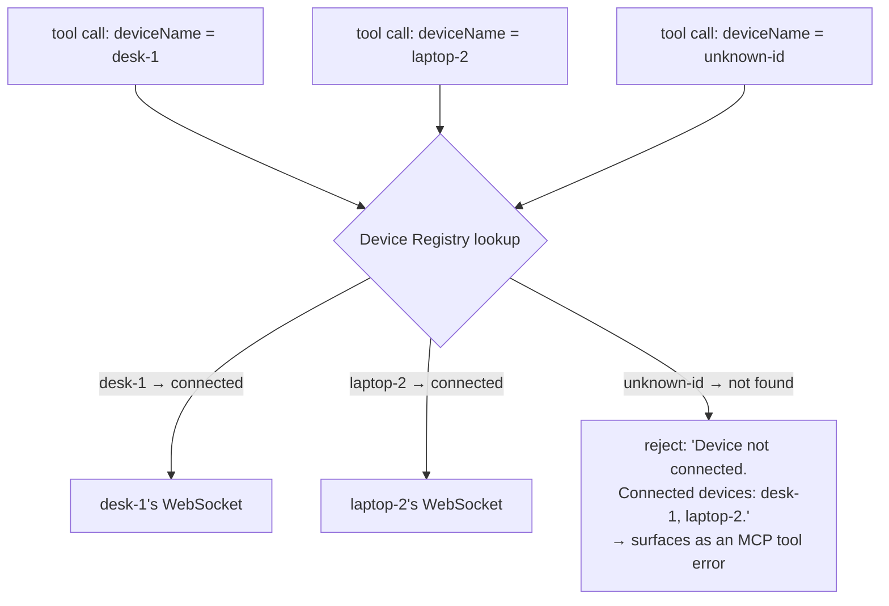

# Multi-Device, Multi-Agent Flow

How multiple agents and multiple paired desktops share one Cloud MCP Server, and exactly how
a tool call travels end to end. Companion to [CLOUD_RELAY_PLAN.md](CLOUD_RELAY_PLAN.md) and
[CLOUD_HOSTING_GUIDE.md](CLOUD_HOSTING_GUIDE.md).

## The actors

| Actor | What it is | How many |
| --- | --- | --- |
| Agent | A web agent or desktop AI agent speaking MCP | Many, any number can connect at once, all to the same URL |
| Cloud MCP Server | One process, exposes one universal `/mcp` (HTTP) and `/device-link` (WebSocket) endpoint | One (v1 is single-instance) |
| Local Tool Service | Runs on a controlled desktop, connects out to the cloud server | Many, one per desktop, each with its own `deviceId` |

Two identifiers make the whole system work:

- **`deviceId`** — chosen by each Local Tool Service (a random UUID by default). Every tool
  call names its target device by passing this same value as the `deviceName` argument.
  It's both the routing key (which desktop a call goes to) *and*, in v1's no-auth design,
  the only access-control check — see the security note at the bottom.
- **`requestId`** — a fresh UUID generated per tool call, used only to match a `tool_result`
  back to the `tool_call` that produced it (several calls can be in flight at once, from
  different agents, to different devices, all sharing the same process and the same MCP
  connection).

One agent connection is enough to control every paired device — there's no need to
reconnect or switch endpoints to target a different desktop, an agent just names a
different `deviceName` on its next tool call. A `list_devices` tool lets an agent discover
which device IDs are currently connected before targeting one (e.g. "take a screenshot of
`local-test-device`" → `screenshot({ deviceName: "local-test-device" })`).

## Architecture



Key points:
- **One endpoint for everyone.** Every agent connects to the exact same `/mcp` URL,
  regardless of which (or how many) devices it intends to control.
- **Every Local Tool Service connection is outbound**, so no port-forwarding or inbound
  firewall rule is ever needed on the controlled desktop — it dials out to the cloud server
  exactly like a browser tab would.

## 1. Device registration (happens once per Local Tool Service, on startup)

```mermaid
sequenceDiagram
    participant D as Local Tool Service (deviceId=desk-1)
    participant Link as /device-link (WS server)
    participant Reg as Device Registry

    D->>Link: open WebSocket (outbound)
    D->>Link: {type:"register", deviceId:"desk-1"}
    Link->>Reg: register("desk-1", thisSocket)
    Note over Reg: If "desk-1" was already registered<br/>on a different socket, that old<br/>connection is closed (last-writer-wins).
    loop every 30s
        Link-->>D: {type:"ping"}
        D-->>Link: {type:"pong"}
    end
```

If the connection drops (network blip, laptop sleep, cloud instance restart), the Local Tool
Service reconnects with exponential backoff and registers again — the registry entry is
simply overwritten.

## 2. One tool call, end to end

Any agent can call any tool at any time, naming whichever device it wants in the `deviceName`
argument; here's a `screenshot` call from Agent A targeting `desk-1`, over the one shared
`/mcp` connection:

```mermaid
sequenceDiagram
    participant Agent as Agent A
    participant MCP as Universal MCP endpoint (/mcp)
    participant Tool as screenshot.tool.ts
    participant Relay as RelayScreenshotService
    participant Reg as Device Registry
    participant Link as /device-link (WS)
    participant Local as Local Tool Service (desk-1)

    Agent->>MCP: tools/call "screenshot" {deviceName:"desk-1"}
    MCP->>Tool: handler({deviceName:"desk-1"})
    Tool->>Relay: createServices("desk-1", registry).capturePrimaryDisplay()
    Relay->>Reg: sendRequest("desk-1", "screenshot.capturePrimaryDisplay")
    Reg->>Reg: new requestId, store {resolve, reject, timeout}
    Reg->>Link: send {type:"tool_call", requestId, tool, args}
    Link->>Local: forward over the desk-1 WebSocket
    Local->>Local: dispatch → NutjsScreenshotService (real screen capture)
    Local-->>Link: {type:"tool_result", requestId, ok:true, result}
    Link-->>Reg: handleResult(requestId)
    Reg-->>Relay: resolve pending promise with result
    Relay-->>Tool: ScreenshotResult (base64 PNG + metadata)
    Tool-->>MCP: MCP tool result
    MCP-->>Agent: response
```

The cloud server never talks to the OS itself. Each tool file (`src/tools/*.tool.ts`) reads
its own `deviceName` argument and builds a small, disposable set of `Relay*Service` objects
for that one call via `createServices(deviceName, deviceRegistry)`; those just do the
`sendRequest(...)` step above with a different `tool` name. Nothing about the tool's
registration or the MCP server itself is bound to any device — the same global `McpServer`
instance answers calls for every device.

## Multi-device routing in one picture

Routing is resolved **per tool call**, from that call's own `deviceName` argument — not from
the URL, and not from which agent is asking:



## Multiple agents, one device

Nothing stops two agents (or the same agent, twice) from naming the same `deviceName`
concurrently. Each call gets its own `requestId`, so responses never cross-talk — but the
*physical* mouse/keyboard/screen is a single shared resource, so two agents clicking at the
same time will genuinely race on the real desktop, the same way two people sharing one mouse
would. That's an inherent limitation of controlling one real machine, not a protocol bug.

## Discovering devices: `list_devices`

Before targeting a device, an agent can call `list_devices` (no arguments) to get the
currently connected `deviceId`s:

```json
{ "success": true, "devices": ["desk-1", "laptop-2"], "timestamp": "..." }
```

This is also what feeds the offline-device error message below — the cloud server always
knows the full connected list when a call fails.

## Failure paths

- **Device never registered / disconnected**: `sendRequest` finds no socket and rejects
  immediately with `Device "<id>" is not connected. Connected devices: ...` (or "No devices
  are currently connected.") — the agent sees a normal MCP tool error, no hang, and enough
  information to retry with a valid `deviceName`.
- **Device registered but unresponsive**: after 15s (default) with no matching `tool_result`,
  the pending request times out and rejects with a clear message naming the tool and device.
- **Device reconnects with a new socket**: the old socket (if still open) is closed by the
  registry; any requests still pending against it will simply time out rather than resolve.

## Security note

Because `deviceId` is both the routing key and (in v1) the *only* access check, treat it as a
secret exactly like an API key — see the "Auth" decision in
[CLOUD_RELAY_PLAN.md](CLOUD_RELAY_PLAN.md). Anyone who can reach the cloud server's URL and
knows a `deviceId` can call every tool against that desktop.
