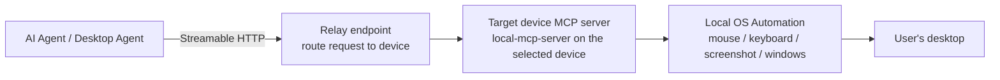
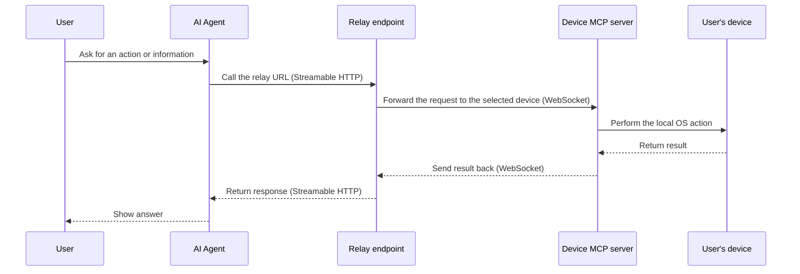
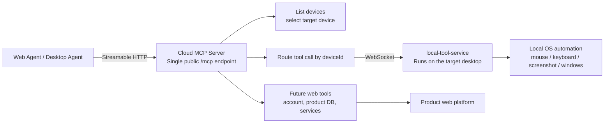
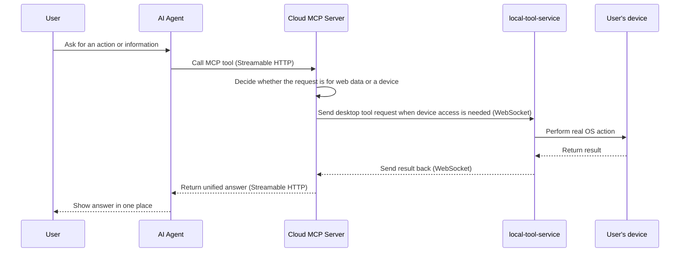
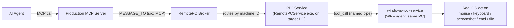
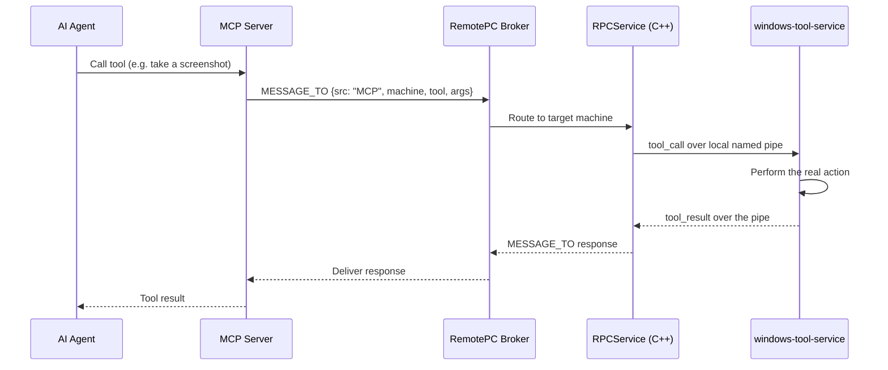

# MCP Flow for Presentation

This document gives a short, presentation-friendly view of the current local MCP setup and the planned cloud MCP setup.

## 1. Current model: local MCP server on each device

This is the same basic pattern used by HopToDesk-style desktop control: the agent connects to a relay endpoint first, and the relay routes the request to the correct device's local MCP server when it wants screen, mouse, keyboard, or window access.

### What this gives us today

- The agent can access the user's local system.
- The relay can direct each request to the correct device MCP server.
- Each device is controlled independently.
- The implementation stays simple because the local server is focused only on desktop automation.

### End-to-end flow in simple terms

## 2. Planned model: cloud MCP server + local tool service

The cloud MCP server becomes the central entry point for agents. It will route device actions to the correct desktop through `local-tool-service`, and later it can also expose web tools and product services.

### Why the cloud model matters

- One agent connection can see all connected devices.
- The cloud server can later include web-based tools, not only desktop control.
- User context can live in one place: account data, product data, device data, and desktop actions.
- This makes the agent experience more complete for both web and desktop usage.

## 3. End-to-end flow in simple terms

## 4. Current & future optimisation plan

- Today: we already support local desktop access through a local MCP server.
- Next: the cloud MCP server will become the central control plane for many devices.
- Later: the same cloud server can also expose product web tools, account data, and internal services, so the user gets a single place to ask questions and act on both web and desktop resources.

## 5. Production-ready flow (current implementation)

This is the flow now built and running end-to-end — five components, from the AI agent down to the real desktop action and back. Unlike the models above, this one reuses the **existing RemotePC broker and RPCService** already deployed on every managed machine, instead of a new relay.

### Step by step

1. **AI Agent** calls a tool on the **MCP Server**, naming the target machine.
2. **MCP Server** builds a `MESSAGE_TO` message (marked `src: "MCP"`) and sends it to the **RemotePC Broker** — the same broker already used for all other RemotePC traffic.
3. **RemotePC Broker** routes the message to the correct machine, same as any other broker message.
4. **RPCService** (the existing C++ Windows service already running on every managed PC) sees `src: "MCP"` and diverts the message to a local named pipe instead of handling it itself.
5. **windows-tool-service** (a small WPF app running in the signed-in user's own desktop session) is the only thing on the other end of that pipe. It receives the tool call, actually performs it (mouse, keyboard, screenshot, CMD, file read), and sends the result back over the same pipe.
6. The result travels back the exact same path in reverse: windows-tool-service → RPCService → Broker → MCP Server → AI Agent.

### Why it's split this way

- **RPCService** already runs as a Windows service with full system access on every machine — perfect for owning the local pipe, but services don't share the interactive user's desktop session, so it can't safely move the mouse or take a screenshot itself.
- **windows-tool-service** runs *inside* the signed-in user's session — the only place that can actually control the desktop — but has no direct connection to the broker.
- Together they give the AI agent full desktop control without either side taking on a job it can't safely do, and without needing any new infrastructure beyond what's already deployed.

### Sequence view

