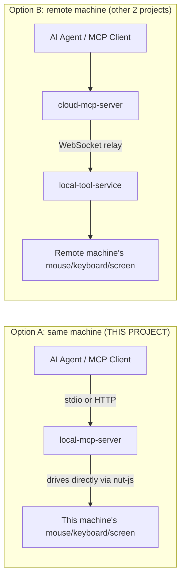
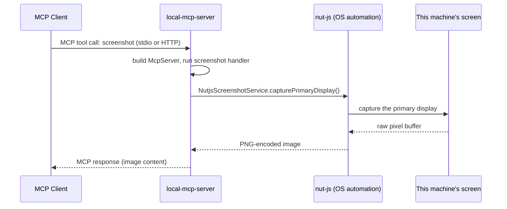

# How Local MCP Server Works (Beginner's Guide)

This document explains this project in plain language — no prior MCP or
Node.js server experience assumed. If you only ever read one file to
understand this codebase, read this one.

## 1. What is this project, in one sentence?

`local-mcp-server` (package name `remotepc-mcp`) is an MCP server that runs
**directly on the same machine it controls** — it exposes mouse, keyboard
and screenshot tools to an AI agent, and drives the real OS APIs itself via
the `nut-js` automation library. There is no network relay involved.

## 2. Where it fits in the bigger picture

There are 3 projects in this repo. This one is a **self-contained
alternative** to the cloud + relay pair:

Use this project when the AI agent and the computer being controlled are the
**same machine** (e.g. Cline running locally). Use `cloud-mcp-server` +
`local-tool-service` when they are **different machines**.

## 3. The framework and libraries, explained simply

| Package | What it actually does here |
|---|---|
| **`@modelcontextprotocol/server`** | The official MCP SDK. Gives us `McpServer` (register "tools"), `createMcpHandler` (MCP over HTTP), and `serveStdio` (MCP over stdin/stdout). |
| **`@modelcontextprotocol/node`** | Adapter helpers: `toNodeHandler` (fetch-style handler → Node `(req,res)`), plus `localhostHostValidation`/`localhostOriginValidation` (rejects requests whose `Host`/`Origin` header isn't loopback — a defense against a malicious webpage's browser tricking the server via DNS rebinding). |
| **`node:http`** (built into Node.js) | The raw HTTP server used only for the "remote" transport. No Express/Fastify. |
| **`@nut-tree-fork/nut-js`** | Cross-platform desktop automation library — this is what actually moves the mouse, presses keys, and grabs screenshots. |
| **`pngjs`** | Encodes captured screenshots as PNG bytes for the screenshot tool's response. |
| **`zod`** | Validates and describes each tool's input arguments. |

**What is "MCP"?** The Model Context Protocol is a standard way for an AI
agent to discover a list of named "tools" (each with a description and a
typed argument schema) and call them, getting structured content back.

## 4. The two transports — and why there are two

[src/index.ts](src/index.ts) picks one of two entrypoints based on the
`MCP_TRANSPORT` environment variable:

| `MCP_TRANSPORT` | File | Used when... |
|---|---|---|
| `stdio` (default) | [src/server/local-server.ts](src/server/local-server.ts) | An MCP host (e.g. Cline, Claude Desktop) launches this file as a **child process** and talks to it over its stdin/stdout pipes. This is the common case for a purely local tool. |
| `http` | [src/server/remote-server.ts](src/server/remote-server.ts) | Something needs to reach this server **over the network** using Streamable HTTP, e.g. `http://127.0.0.1:3000/mcp`. Binds to loopback (`127.0.0.1`) by default and validates `Host`/`Origin` headers. |

Both transports call the exact same
[src/server/create-server.ts](src/server/create-server.ts)`createServer()`
factory and register the exact same tools — so tool behavior never diverges
between the two connection methods, only the plumbing around them differs.

## 5. Step-by-step: what happens when a tool is called

Say the agent calls the `screenshot` tool:

The code path, file by file:

1. [src/server/create-server.ts](src/server/create-server.ts) builds a fresh
   `McpServer`, calls
   [src/services/service-factory.ts](src/services/service-factory.ts)`createServices()`
   to build the 4 concrete backend services, then registers all 6 tools via
   [src/tools/index.ts](src/tools/index.ts), wrapped in a logging layer
   (`withToolCallLogging`) that prints every call/result to stderr.
2. **[src/tools/screenshot.tool.ts](src/tools/screenshot.tool.ts)** defines
   the `screenshot` tool's schema and handler. The handler simply calls
   `services.screenshotService.capturePrimaryDisplay()` — it has no idea
   *how* the screenshot is taken, only that some object implementing
   `IScreenshotService` will do it.
3. **[src/services/service-factory.ts](src/services/service-factory.ts)**
   is the single place that decides which concrete class backs each
   interface, controlled by the `TOOL_BACKEND` env var:
   - `"nutjs"` (default) → real OS-driving classes in
     [src/services/implementations/nutjs/](src/services/implementations/nutjs).
   - `"placeholder"` → fake, deterministic classes in
     [src/services/implementations/placeholder/](src/services/implementations/placeholder)
     that don't touch the OS at all (useful for tests / CI).
4. **`NutjsScreenshotService`** calls into `@nut-tree-fork/nut-js` directly
   on this same process/machine — there is no network hop and no separate
   process to relay through, unlike the cloud + relay setup.
5. The result travels straight back up: service → tool handler → MCP SDK →
   whichever transport (stdio or HTTP) is active → the agent.

Because both transports share one `createServer()` factory, this exact flow
is identical regardless of which transport is in use — only how the bytes
physically reach the process differs.

## 6. The available tools

Registered in [src/tools/index.ts](src/tools/index.ts):

| Tool | What it does |
|---|---|
| `screenshot` | Captures the primary display. |
| `mouse_move` / `mouse_click` | Moves / clicks the mouse. |
| `type_text` / `key_press` | Types text / presses a key. |
| `get_window_list` | Lists open windows. |

(No `list_devices` tool here — unlike the cloud server, there is only ever
one machine: the one this process is running on.)

## 7. Key files at a glance

| File | Responsibility |
|---|---|
| [src/index.ts](src/index.ts) | Chooses stdio vs HTTP transport based on `MCP_TRANSPORT`. |
| [src/server/local-server.ts](src/server/local-server.ts) | Serves MCP over stdio (`serveStdio`). |
| [src/server/remote-server.ts](src/server/remote-server.ts) | Serves MCP over Streamable HTTP with loopback-only Host/Origin validation. |
| [src/server/create-server.ts](src/server/create-server.ts) | Builds one `McpServer`, wires services, registers all tools + logging. |
| [src/services/service-factory.ts](src/services/service-factory.ts) | Picks `nutjs` vs `placeholder` backend via `TOOL_BACKEND`. |
| [src/services/interfaces/](src/services/interfaces) | The 4 service contracts (`IMouseService`, `IKeyboardService`, `IScreenshotService`, `IWindowService`) tools depend on. |
| [src/services/implementations/nutjs/](src/services/implementations/nutjs) | Real OS automation via `@nut-tree-fork/nut-js`. |
| [src/services/implementations/placeholder/](src/services/implementations/placeholder) | Fake, no-OS-access implementations for tests. |
| [src/tools/](src/tools) | One file per MCP tool: schema + handler. |

## 8. Glossary

- **MCP tool** — a named, self-describing function an AI agent can call
  (name + description + argument schema).
- **Transport** — how MCP messages physically travel: **stdio** (pipes of a
  child process) or **Streamable HTTP** (plain HTTP requests).
- **Service interface** — an abstraction (e.g. `IMouseService`) that lets
  tool code stay identical whether the real OS or a fake test double is
  behind it.
- **`TOOL_BACKEND`** — environment variable that switches between the real
  (`nutjs`) and fake (`placeholder`) service implementations.
