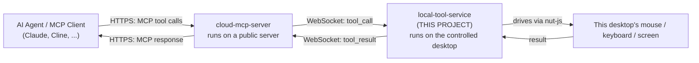
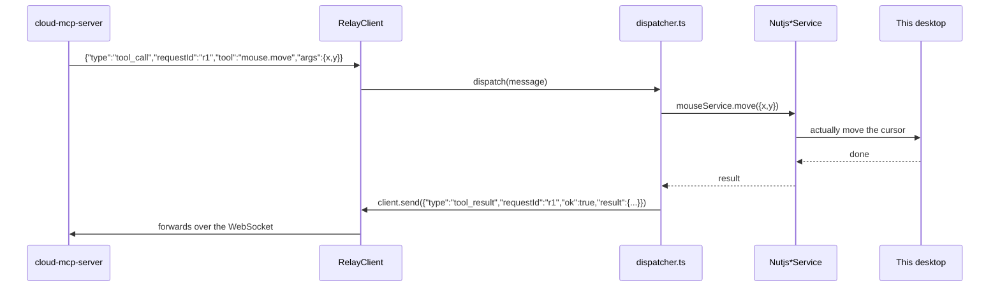

# How Local Tool Service Works (Beginner's Guide)

This document explains this project in plain language — no prior Node.js
server or MCP experience assumed. If you only ever read one file to
understand this codebase, read this one.

## 1. What is this project, in one sentence?

`local-tool-service` runs on the **controlled desktop** (the machine you
want to remotely operate). It connects **outward** to a `cloud-mcp-server`
over a WebSocket, waits for instructions, and executes real mouse/keyboard/
screenshot/window actions on this machine using the `nut-js` automation
library, then reports the result back.

**Important:** this project is *not* an MCP server itself, and it does not
depend on the MCP SDK at all (check [package.json](package.json) — there's
no `@modelcontextprotocol/*` dependency here). It only speaks this repo's own
small WebSocket "relay" protocol. Think of it as the **hands** that
`cloud-mcp-server` (the "brain") tells what to do.

## 2. Where it fits in the bigger picture

This project only ever talks to `cloud-mcp-server` — it has no idea an AI
agent or MCP even exists. It just answers `tool_call` messages with
`tool_result` messages.

## 3. The framework and libraries, explained simply

| Package | What it actually does here |
|---|---|
| **`ws`** | A WebSocket library, used here in *client* mode — this process dials **out** to the cloud server, unlike `cloud-mcp-server` which accepts incoming connections. |
| **`@nut-tree-fork/nut-js`** | Cross-platform desktop automation library — actually moves the mouse, presses keys, captures the screen, lists windows. |
| **`pngjs`** | Encodes captured screenshots as PNG bytes. |
| **`systray2`** | Shows a small system tray icon (Windows/macOS/Linux) with a live "Connected"/"Disconnected" status, the device's ID (click to copy), and a Quit action. It's a CommonJS-only package, so [src/tray.ts](src/tray.ts) `require()`s it manually instead of using an ESM `import`, to sidestep a default-export typing quirk. |

There is deliberately **no HTTP server, no MCP SDK, and no incoming
listener** in this project — it is a pure outbound WebSocket client plus a
tray icon plus an installer.

## 4. Step-by-step: what happens when it starts

Entry points, from simplest to fullest:

- **[src/index.ts](src/index.ts)** — just calls `start()`. Used by `npm start` / `node build/index.js`.
- **[src/cli.ts](src/cli.ts)** — the `local-tool-service` command (see `bin`
  in [package.json](package.json)), with 3 subcommands: `start` (default),
  `install`, `uninstall`.

Tracing `start()` in [src/start.ts](src/start.ts):

1. **`loadConfig()`** ([src/config.ts](src/config.ts)) reads `CLOUD_URL`
   (default `ws://127.0.0.1:4000`) and `DEVICE_ID` from environment
   variables. If `DEVICE_ID` isn't set, it looks for a previously-generated
   one at `~/.local-tool-service/config.json`; if that doesn't exist either,
   it generates a random UUID and saves it there — so this machine keeps the
   **same identity** across restarts without any manual setup.
2. Four real, OS-driving service instances are created directly:
   `NutjsMouseService`, `NutjsKeyboardService`, `NutjsScreenshotService`,
   `NutjsWindowService` (in [src/services/implementations/nutjs/](src/services/implementations/nutjs)).
3. A **`RelayClient`** is created ([src/relay/relay-client.ts](src/relay/relay-client.ts))
   and told to run `createDispatcher(services, client)` whenever a
   `tool_call` message arrives.
4. `client.connect()` opens the WebSocket to `${cloudUrl}/device-link`.
5. If `cli.ts` was used and `NO_TRAY` isn't `1`, `startTray()`
   ([src/tray.ts](src/tray.ts)) also shows the system tray icon.

## 5. Step-by-step: staying connected

[src/relay/relay-client.ts](src/relay/relay-client.ts) handles the WebSocket
lifecycle:

- **On open:** immediately sends `{"type": "register", "deviceId": "..."}`
  so the cloud server knows which device this socket belongs to.
- **On `ping` from the server:** replies with `{"type": "pong"}` (a
  heartbeat, so the cloud server can detect a dead connection).
- **On `tool_call` from the server:** hands the message to whatever handler
  was registered via `onToolCallMessage()` (that's the dispatcher).
- **On close:** marks itself disconnected and reconnects automatically,
  starting at a 1 second delay and doubling up to a 30 second cap each time
  the connection drops — so a temporary network blip or cloud server
  restart recovers on its own without restarting this process.

## 6. Step-by-step: executing a tool call

The code, step by step in
[src/relay/dispatcher.ts](src/relay/dispatcher.ts):

1. `createDispatcher(services, client)` returns an async `dispatch()`
   function, which is exactly what `RelayClient` calls for every incoming
   `tool_call`.
2. `dispatch()` logs the incoming call, then calls the internal `callTool()`
   helper, which is a plain `switch` on `message.tool`
   (`"mouse.move"`, `"mouse.click"`, `"keyboard.typeText"`,
   `"keyboard.keyPress"`, `"screenshot.capturePrimaryDisplay"`,
   `"window.listWindows"`) that calls the one matching real service method.
3. Whatever that service method returns is wrapped as
   `{ type: "tool_result", requestId, ok: true, result }` and sent straight
   back over the same `RelayClient` socket.
4. If the service call throws, the `catch` block instead sends
   `{ type: "tool_result", requestId, ok: false, error: "<message>" }` — the
   cloud server turns this into a rejected promise on its end, which becomes
   an MCP error response to the AI agent.

Every step here is logged to stderr, so running this process in a terminal
shows a live trace of every command it's asked to perform.

## 7. The shared "relay protocol"

[src/relay/relay-protocol.ts](src/relay/relay-protocol.ts) defines the exact
JSON message shapes (`register`, `ping`/`pong`, `tool_call`, `tool_result`)
used over the WebSocket. **This file is intentionally kept byte-for-byte
identical to `cloud-mcp-server/src/relay/relay-protocol.ts`** — both ends
must agree on the wire format, and there's no shared package between the two
projects, so if you ever change one copy, mirror the change in the other.

## 8. The system tray and installers

- **[src/tray.ts](src/tray.ts)** — optional UI so a non-technical user can
  see at a glance whether this machine is connected, copy its device ID (to
  paste into an AI agent's `deviceName` argument), and quit. Falls back to
  running headless if icon assets are missing.
- **[src/install/](src/install)** — per-OS scripts (`install-windows.ts`,
  `install-macos.ts`, `install-linux.ts`) that register this service to
  start automatically at login/boot, so it's always running and connected
  without the user manually launching it.

## 9. Key files at a glance

| File | Responsibility |
|---|---|
| [src/cli.ts](src/cli.ts) | `start`/`install`/`uninstall` command entrypoint. |
| [src/start.ts](src/start.ts) | Wires config + real services + `RelayClient` together and connects. |
| [src/config.ts](src/config.ts) | Loads/persists `deviceId` and `cloudUrl`. |
| [src/relay/relay-client.ts](src/relay/relay-client.ts) | Outbound WebSocket connection, reconnect-with-backoff, heartbeat. |
| [src/relay/dispatcher.ts](src/relay/dispatcher.ts) | Executes an incoming `tool_call` against the real services and replies. |
| [src/relay/relay-protocol.ts](src/relay/relay-protocol.ts) | Shared wire message shapes (mirrors `cloud-mcp-server`). |
| [src/services/implementations/nutjs/](src/services/implementations/nutjs) | Real OS automation via `@nut-tree-fork/nut-js`. |
| [src/tray.ts](src/tray.ts) | System tray status icon. |
| [src/install/](src/install) | Per-OS auto-start installation scripts. |

## 10. Glossary

- **Relay protocol** — this repo's own small JSON message format for the
  cloud ↔ device WebSocket; unrelated to MCP itself.
- **`requestId`** — an ID chosen by the cloud server so it can match this
  service's `tool_result` reply back to the right waiting request.
- **Device identity** — a persisted random UUID that lets this machine be
  addressed consistently across restarts (`deviceName` in the agent's tool
  calls).
- **Reconnect-with-backoff** — after a dropped connection, wait a short time
  before retrying, doubling the wait each consecutive failure (capped), to
  avoid hammering the cloud server.
