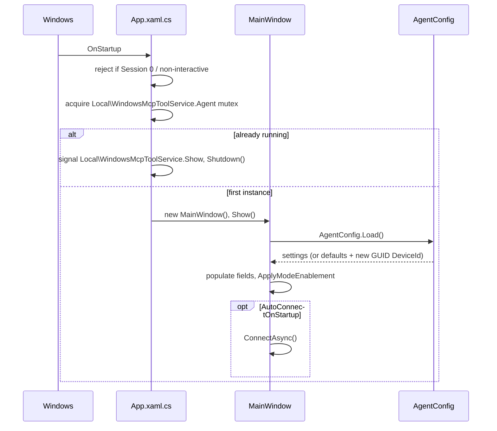
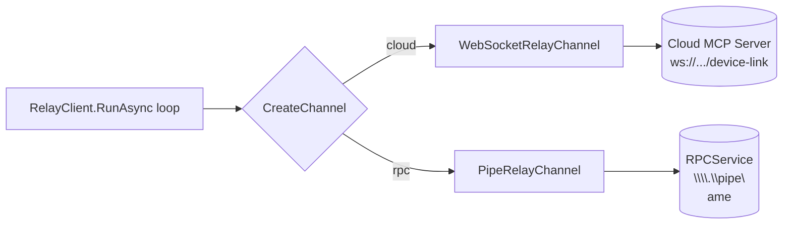
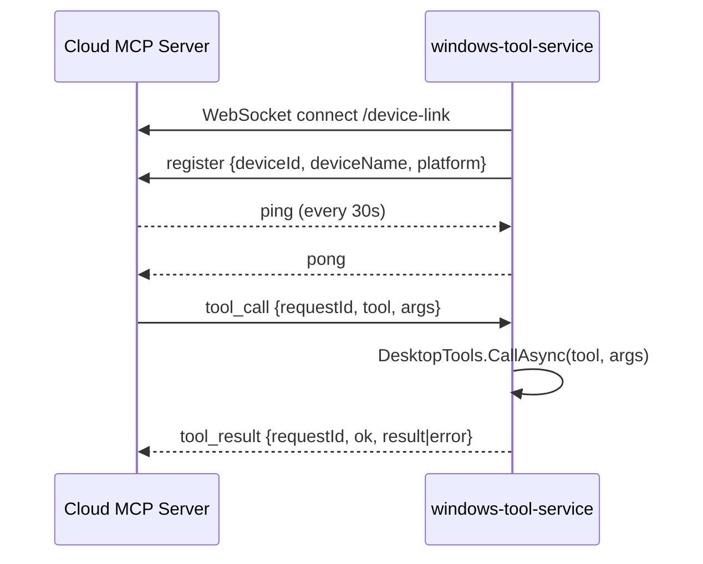
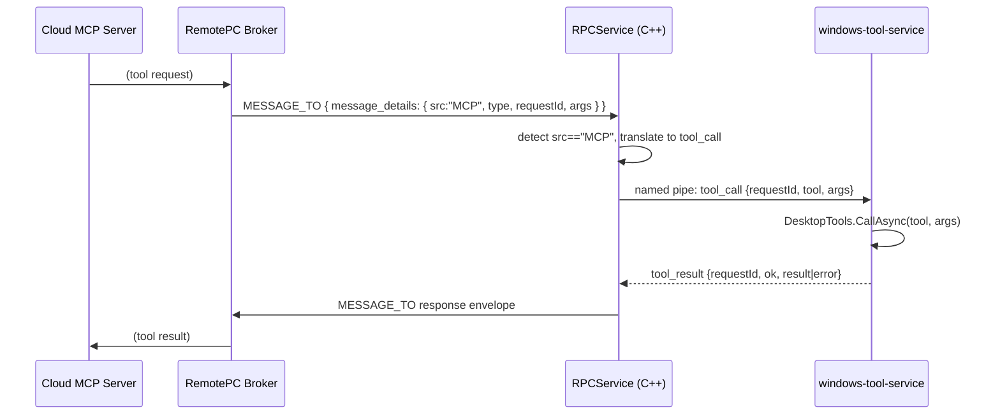

# windows-tool-service — Project Flow

A borderless WPF desktop agent (.NET Framework 4.5, x64) that runs in a user's Windows session and executes remote-control tools (mouse/keyboard, screenshots, window listing, CMD, file read) on behalf of a cloud MCP server or a local production broker. This document explains every file, how they connect, and the full request/response journey in both of its two connection modes.

## 1. What the service is

- **Type:** WPF `WinExe`, single window (`MainWindow`), no Windows Service, no elevation.
- **Runs as:** the signed-in interactive user only (rejects Session 0 / non-interactive launches).
- **Single instance:** a named Mutex (`Local\WindowsMcpToolService.Agent`) blocks a second copy; the existing window is brought to the foreground instead via a named `EventWaitHandle`.
- **Job:** stay connected to *something* that hands it tool calls (`tool_call` messages), execute them locally (mouse/keyboard/screenshot/window/cmd/file), and send back `tool_result` messages.
- **Two interchangeable transports:** direct WebSocket to the Cloud MCP Server (testing), or a local named pipe to a separate "RPCService" process (production). Everything except the transport is identical.

## 2. File map

| File | Role |
|---|---|
| [App.xaml](App.xaml) / [App.xaml.cs](App.xaml.cs) | Process entry point. Session/interactivity checks, single-instance mutex + show-event, creates and shows `MainWindow`. |
| [MainWindow.xaml](MainWindow.xaml) / [MainWindow.xaml.cs](MainWindow.xaml.cs) | The only UI. Connection settings, mode switch, Connect/Disconnect, live activity log. |
| [AgentConfig.cs](AgentConfig.cs) | Typed settings model, JSON load/save, validation, and the small `Arguments` helper used by every tool for arg parsing. |
| [RelayClient.cs](RelayClient.cs) | Transport-agnostic message loop: connect → (register) → read `ping`/`tool_call` → dispatch → reply `tool_result`. Reconnects with backoff. |
| [RelayChannel.cs](RelayChannel.cs) | `IRelayChannel` abstraction plus its two implementations: `WebSocketRelayChannel` (cloud) and `PipeRelayChannel` (RPCService). |
| [DesktopTools.cs](DesktopTools.cs) | The single tool dispatcher (`CallAsync`). Routes each tool name to its handler: Win32 mouse/keyboard, screenshot capture, window enumeration, CMD, file read. |
| [WinPtyCommand.cs](WinPtyCommand.cs) | Runs one CMD line through WinPTY (a real console, not `Process.Start` redirection) with timeout + output cap. |
| [FileTools.cs](FileTools.cs) | Reads a local file (validated, ≤10 MB) and uploads it via `S3Presigner`, returning a presigned URL. |
| [S3Presigner.cs](S3Presigner.cs) | Minimal hand-rolled AWS SigV4 signer for S3-compatible storage (IDrive e2). Uploads bytes, returns a presigned GET URL. |
| [Log.cs](Log.cs) | Append-only rotating log file (`MCPToolService.Log`) next to the EXE. Never throws. |
| [ToolInfo.json](ToolInfo.json) | Reference copy of the MCP tool schemas (documentation for the tool set, not loaded at runtime). |
| [App.config](App.config) | Targets .NET Framework 4.5. |
| [WindowsToolService.csproj](WindowsToolService.csproj) / [WindowsToolService.Tests.csproj](WindowsToolService.Tests.csproj) | Old-style MSBuild projects — every new `.cs` file must be added as an explicit `<Compile Include>`. |
| [build.ps1](build.ps1) | Headless build+smoke-test runner for the Tests project only (the app itself is built from Visual Studio or `msbuild`). |
| [tests/SmokeTests.cs](tests/SmokeTests.cs) | In-process checks (Win32 layout, key mapping, config validation, file/storage/CMD behavior) plus `--relay`/`--pipe`/`--native` live-integration entry points. |
| [tests/relay.test.mjs](tests/relay.test.mjs) | Node test spawning the EXE in `--relay` mode against a real `ws` server — exercises the cloud transport end-to-end. |
| [tests/relay-pipe.test.mjs](tests/relay-pipe.test.mjs) | Node test spawning the EXE in `--pipe` mode against a real named-pipe server — exercises the RPC transport end-to-end. |

## 3. Startup flow

- `AgentConfig.Load()` reads `%LocalAppData%\WindowsMcpToolService\config.json`. If missing, defaults are `CloudUrl=ws://127.0.0.1:4000`, a new `DeviceId` GUID, and `DeviceName=Environment.MachineName`. Older config files without `ConnectionMode`/`PipeName` are back-filled to `"cloud"` / `"RPCService.MCP.Relay"` so upgrades never break.
- `Validate()` runs on every load/save: cloud mode requires a `ws://`/`wss://` `CloudUrl` (plain `ws://` only for loopback) plus non-empty `DeviceId`/`DeviceName`; RPC mode only requires a `PipeName` with no path separators — identity fields are optional there because RPCService/the broker own device identity.

## 4. The UI (MainWindow)

Borderless, self-styled WPF window (`WindowStyle=None`, custom rounded-border template). Sections, top to bottom:

1. **Connection** — a `modeCloud`/`modeRpc` radio row, then `Cloud URL`, `Pipe name`, `Device ID` (masked `PasswordBox`), `Device name`.
2. **Options** — `Allow remote CMD execution` (guarded by a confirmation dialog before it can be turned on) and `Connect on startup`.
3. **Activity** — a status line (`state`) plus a scrolling, size-capped (20,000→15,000 chars) log box (`activity`) fed by every `RelayClient` status callback.
4. **Action bar** — `Connect` / `Disconnect` buttons.

`ApplyModeEnablement(enabled)` is the single place that decides which fields are usable: in **cloud** mode, `Cloud URL`/`Device ID`/`Device name` are enabled and `Pipe name` is disabled; in **rpc** mode it's the reverse. It's called from `Window_Loaded`, the mode radio buttons' `Checked` handler, and `SetControls` (which also disables everything while connected, per the "one connection at a time" model).

`ConnectAsync()` (on Connect click or auto-connect): reads the UI into `_config`, calls `_config.Save()`, builds a fresh `DesktopTools` + `RelayClient`, and runs `relay.RunAsync()` on a background `Task`. `StopAsync()` cancels the token and awaits that task; it's idempotent (safe to call from both the Disconnect button and `Window_Closing`). Closing the window while connected first disconnects gracefully, then closes.

## 5. Connection modes — the core design

`AgentConfig.EffectiveConnectionMode` is `"rpc"` or `"cloud"` (defaulting to `"cloud"` for old configs). `RelayClient.CreateChannel()` picks the transport per mode:

Both channels implement the same tiny `IRelayChannel` interface (`ConnectAsync` / `SendAsync(string json)` / `ReceiveAsync() -> string|null` / `Dispose`), so `RelayClient`'s message loop, tool dispatch, reconnect/backoff, and busy-gating logic are **100% shared** — only how bytes get to the other end differs:

- **`WebSocketRelayChannel`** — `ClientWebSocket` to `CloudUrl.TrimEnd('/') + "/device-link"`, TLS 1.2 forced, 15s connect timeout, chunked receive capped at 1 MiB.
- **`PipeRelayChannel`** — `NamedPipeClientStream(".", pipeName, InOut, Asynchronous)`, one JSON object per line (newline-delimited; safe because JSON serializers escape embedded newlines inside string values). Connects synchronously inside `Task.Run` with a 15s timeout because `NamedPipeClientStream` has no cancellable async connect on .NET Framework 4.5; a `CancellationToken.Register` callback disposes the pipe to unblock a cancelled attempt.

### Why `register` and the 500 KB cap are mode-gated
- The `register` handshake (`{type:"register", deviceId, deviceName, platform}`) is sent **only in cloud mode** — the Cloud MCP Server's `DeviceRegistry` needs it to route calls to this device, but RPCService already knows which machine it's talking to (it owns the pipe), so registering would be meaningless there.
- The 500 KB result-size cap (`CapResult`) is the **cloud broker's** limit (its WebSocket message ceiling) — it's applied only in cloud mode. A local named pipe to RPCService has no such ceiling, so large results (e.g. a big `cmd.execute` output) pass through uncapped in rpc mode. `screenshot.capture`/`file.read` results are always small either way, since they return a presigned URL rather than inline bytes.

## 6. Wire protocol (identical in both modes)

| Direction | Message | Shape |
|---|---|---|
| out (cloud only) | register | `{type:"register", deviceId, deviceName, platform:"win32"}` |
| in | ping | `{type:"ping"}` |
| out | pong | `{type:"pong"}` |
| in | tool call | `{type:"tool_call", requestId, tool, args}` |
| out | success | `{type:"tool_result", requestId, ok:true, result}` |
| out | failure | `{type:"tool_result", requestId, ok:false, error}` |

- Only **one tool runs at a time** per device: an internal `actionGate` semaphore rejects a second `tool_call` with `{ok:false, error:"Agent busy; retry after the current action completes."}` while one is in flight.
- Every send/receive is mirrored to the activity log and to `Log.cs`.
- On disconnect (peer close, error, or cancellation) `RunAsync` retries with exponential backoff: 1s, 2s, 4s, … capped at 30s, until the user disconnects.

## 7. Full request/response flow

### 7a. Cloud mode (direct — used for testing tools without RPCService)

### 7b. RPC mode (production — via RPCService)

No `register` is sent in this path — RPCService and the broker already know which machine they're talking to.

## 8. Tool dispatch — `DesktopTools.CallAsync`

Single `switch` on the `tool` string; every branch returns a JSON-serializable object built on top of a common envelope (`success`, `backend`, `timestamp`):

| Tool | Needs interactive desktop? | Notes |
|---|---|---|
| `cmd.execute` | WinPTY checks it itself | Requires `EnableCmd`; delegates to `WinPtyCommand.ExecuteAsync`. |
| `file.read` | No | Uploads via `S3Presigner`; storage must be configured — no inline base64 fallback. |
| `mouse.move` / `mouse.click` | Yes | `SetCursorPos` + `SendInput` (`mouse_event` flags). |
| `mouse.scroll` | Yes | Wheel notches, vertical or horizontal. |
| `mouse.drag` | Yes | Down at `(x,y)`, move to `(toX,toY)`, up. |
| `keyboard.typeText` | Yes | Unicode key-down/up pairs per character. |
| `keyboard.keyPress` | Yes | Resolves key names (letters, digits, F1–F24, aliases) to virtual-key codes; presses together, releases in reverse order (always releases, even on error). |
| `screenshot.capture` | Yes | Captures primary/virtual/display-index/window-title region via GDI+; optional downscale; auto PNG↔JPEG by pixel count; uploads to storage (no inline base64 fallback). |
| `window.listWindows` | Yes | Enumerates visible top-level windows (title, bounds, focus/min/max state, pid, process name, display index). |

`RequireInteractiveDesktop()` calls `OpenInputDesktop`/`SwitchDesktop` to fail fast with a clear error if the session is locked or on a secure desktop (UAC prompt, lock screen) — everything except `cmd.execute` and `file.read` needs this.

### CMD execution (`WinPtyCommand`)
Spawns `cmd.exe /d /s /c "<command>"` inside a real WinPTY console (not simple pipe redirection, so interactive-style output behaves correctly), reads output on a background task, polls for exit every 25ms, and enforces `timeoutMs` (100–20,000, default 10,000). Output is capped at `maxOutputChars` (1,024–400,000, default 65,536). Result includes `exitCode`, `timedOut`, `truncated`, `durationMs`. Requires `winpty.dll` + `winpty-agent.exe` next to the EXE (fetched manually per [native/README.md](native/README.md), gitignored).

### File read / upload (`FileTools` + `S3Presigner`)
Validates the path is absolute, exists, isn't a directory, and is ≤10 MB. Storage (`AgentConfig.StorageEnabled`, all five `E2Storage*` fields set) is **required** — the bytes are PUT to S3-compatible storage using a hand-rolled SigV4 presigner, and a presigned GET URL is returned; there is no inline-base64 fallback, so raw file/image bytes never pass through the relay or broker. Both `file.read` and `screenshot.capture` fail with a clear error if storage isn't configured.

## 9. Configuration reference (`AgentConfig`)

| Field | Meaning |
|---|---|
| `ConnectionMode` | `"cloud"` \| `"rpc"` (see `EffectiveConnectionMode` for the back-compat default). |
| `CloudUrl` | `ws://`/`wss://` base URL for cloud mode (`/device-link` is appended automatically). |
| `PipeName` | Named pipe name for rpc mode (default `RPCService.MCP.Relay`). |
| `DeviceId` / `DeviceName` | Identity sent in `register` — required in cloud mode only. |
| `EnableCmd` | Opt-in gate for `cmd.execute`; toggling it on in the UI requires confirming a warning dialog. |
| `AutoConnectOnStartup` | Connect automatically when the window loads. |
| `E2Storage*` (Endpoint/Region/Bucket/AccessKey/SecretKey) + `StorageGetTtlSeconds` | S3-compatible storage — **required** for `screenshot.capture` and `file.read` (no inline base64 fallback); all five must be set for `StorageEnabled` to be true. |

Stored as JSON at `%LocalAppData%\WindowsMcpToolService\config.json`.

## 10. Logging

`Log.Write` appends timestamped lines to `MCPToolService.Log` next to the EXE, trimming to the most recent 512 KB once the file passes 1 MB. It never throws, so a logging failure can never break the agent. Every relay status change, connect/disconnect action, CMD enable/decline, and raw sent/received JSON message is mirrored here — this is the file to check when diagnosing a deployed agent that isn't reachable interactively.

## 11. Testing

| Command | What it covers |
|---|---|
| `.\build.ps1` | Builds `WindowsToolService.Tests.csproj` and runs the in-process smoke checks (Win32 layout, key mapping, config validation, file/storage/CMD routing). |
| `.\build.ps1 -NativeTest` | Adds real WinPTY + WPF render checks (needs an unlocked desktop). |
| `node --test tests/relay.test.mjs` | Spawns the test EXE with `--relay <url>`, drives it against a real `ws` server — fragmentation, ping/pong, busy error, reconnect, real CMD output. |
| `node --test tests/relay-pipe.test.mjs` | Spawns the test EXE with `--pipe <name>`, drives it against a real named-pipe server — asserts **no register is sent**, plus ping/pong, tool_call round-trip, busy error, reconnect. |

## 12. Security notes

- The cloud relay has no authentication — only use `wss://` off-loopback, and put it behind a VPN/gateway.
- `EnableCmd` and the desktop tools grant full control as the signed-in user; never run this elevated, and only point it at a trusted relay/RPCService.
- One tool runs at a time per device — no queueing, just a busy error.
- Tool arguments/output may be logged — don't pass secrets through them.
